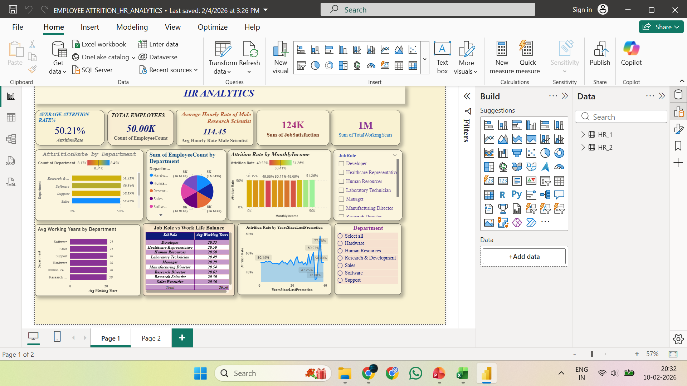
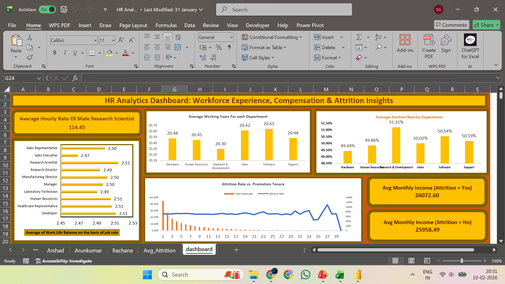
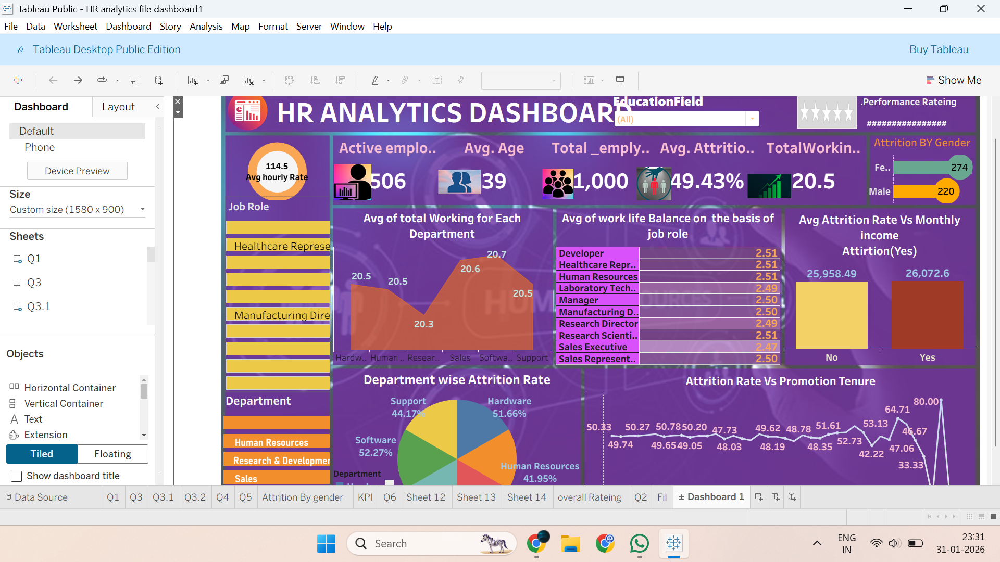

# 📊 HR Analytics – Attrition & Workforce Insights

## 🔹 Project Overview
This project analyzes employee attrition, compensation trends, promotion gaps, and work-life balance using Excel, SQL, Power BI, and Tableau.

The objective was to convert raw HR data into KPI-driven insights and propose strategic HR actions.

---

## 🔹 Tools Used
- Excel (Dashboarding & KPI Analysis)
- SQL (Data Cleaning & KPI Queries)
- Power BI (Interactive Dashboard)
- Tableau (Visual Analytics)

---

## 🔹 Key KPIs Analyzed
- Overall Attrition Rate
- Attrition by Department
- Attrition vs Monthly Income
- Attrition vs Promotion Gap
- Work-Life Balance Index
- Average Working Years

---

## 🔹 Key Insights
- Attrition remains consistently high across departments (~50%)
- Promotion stagnation significantly impacts employee exits
- Salary alone is not a strong retention driver
- Burnout-prone roles show higher attrition risk

---

## 🔹 Strategic Recommendations
- Structured promotion review cycle
- Workload balancing in high-pressure roles
- Skill-based compensation differentiation
- KPI-based attrition monitoring

---

## 🔹 Outcome
This project demonstrates end-to-end data analytics workflow:
Data Cleaning → KPI Creation → Dashboarding → Insight Generation → Strategic Recommendations.

---

## 📌 Dashboard Preview

### 🔹 Power BI Dashboard

### 🔹 Excel Dashboard

### 🔹 Tableau Dashboard

